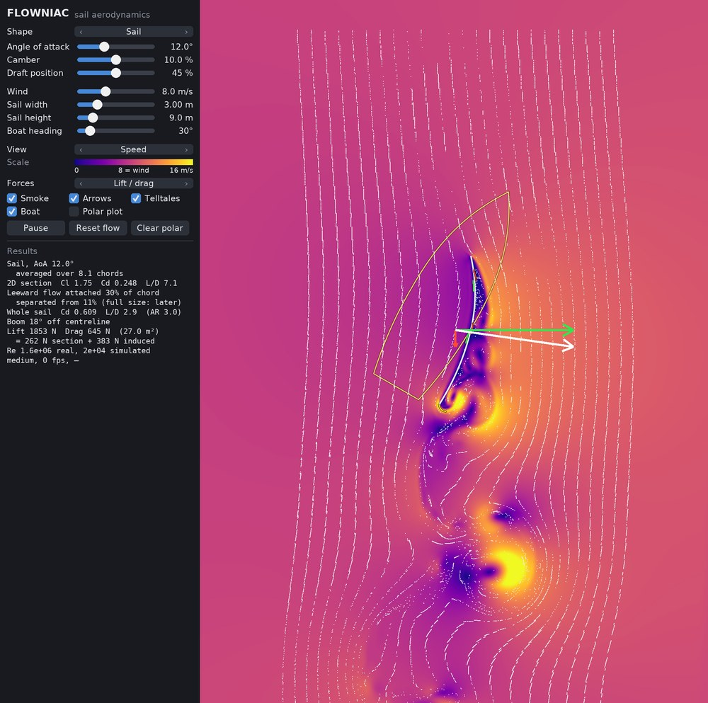

# FLOWNIAC

Educational 2D airflow simulator for sails and other shapes: watch the air flow around a sail, see where
it separates, and read lift, drag and the drive of a dinghy in Newtons. Lattice-Boltzmann on the GPU.

**Try it in the browser:** <https://tnlt-ag.github.io/FLOWNIAC/> (needs WebGPU: current Chrome or Edge,
Safari 26+, Firefox 141+ on Windows)



## What it shows

- Sail with adjustable camber and draft, mast + sail, jib + main, flat plate, cylinder, NACA profiles
- Smoke, telltales on both sides and on the leech, force arrows, a live polar plot
- Speed, vorticity and pressure in real units (m/s, 1/s, Pa)
- 2D section coefficients (Cl, Cd, L/D) and whole-sail forces in N, with an induced-drag estimate
- A dinghy outline with adjustable heading: drive and side force, boom angle
- The wind blows from the top, as sailors draw it
- Grid quality from Low to Ultra (simulated Reynolds number 8'000 to 131'000) and slow motion down to 50x

## Desktop version

No longer developed: new features go into the web version only. Python with
[Taichi](https://www.taichi-lang.org/) (tested with Python 3.12 and Taichi 1.7.4):

```bash
pip install -r requirements.txt
python Flowniac.py
```

The quality is picked automatically from a short GPU speed test (`--quality low|medium|high|ultra` to
override). `python Flowniac.py --help` lists all options; press `i` in the window for the keys.

## Web version

The folder [`web/`](web/) is the simulator for the browser (WebGPU, plain JavaScript, no build step), the
version that is developed further. Its solver is a port of `Flowniac.py` and still gives the same forces;
see [web/README.md](web/README.md) for running it locally and for the parity test. Every push to `web/` on
`main` updates the GitHub Pages site.

## Physics in short

The simulation is 2D and runs at the highest Reynolds number each grid resolves (8'000 to 130'000), far
below a real sail (0.3 to 5 million). Lift is close to full size; section drag comes out higher, and fully
separated flow (stall, downwind) is over-predicted, a 2D limitation. The header of `Flowniac.py`
describes the model, its limits and the validation against reference cases.

## License

Copyright (C) 2026 tnlt AG. FLOWNIAC is free software under the [GNU General Public License v3.0](LICENSE).
It was originally based on [LBM_Taichi](https://github.com/hietwll/LBM_Taichi) by Wang.
